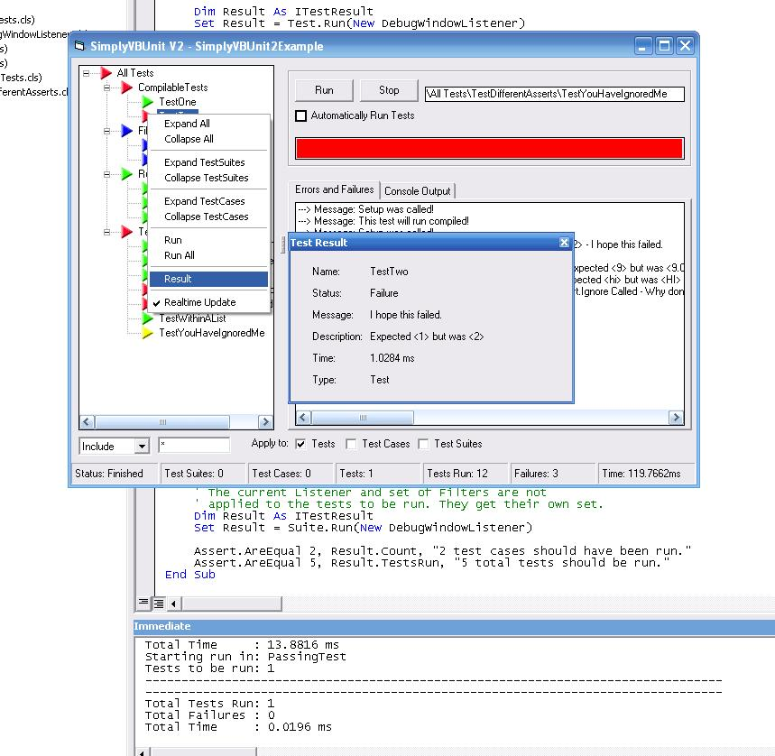



## SimplyVBUnit v2\.1

### Description

* This has been updated to include some GUI stuff. No bugs to be fixed *

This is a UnitTesting framework designed for VB6. For those familiar with UnitTesting know how important it is.

This is a complete rewrite from previous versions. This is built from the ground up as an actual unittesting framework. This new version has several enhancements over the older versions. Such things as filtering, sorting, test suites, listeners and much more.

Using the framework, everything from a simple debug window reporting mechanism to a fullblown GUI can be used to perform UnitTests. Using the framework, any type of reporting can be created by implementing a callback interface. A GUI interface , debug window listener, and examples are included.

I hope this set of tools will be helpful any programmer. Enjoy!
 
### More Info
 

             |
---                |---
**Submitted On**   |2006-02-21 11:23:58
**By**             |[Kelly S\. Ethridge](https://github.com/Planet-Source-Code/PSCIndex/blob/master/ByAuthor/kelly-s-ethridge.md)
**Level**          |Advanced
**User Rating**    |5.0 (55 globes from 11 users)
**Compatibility**  |VB 6\.0
**Category**       |[Libraries](https://github.com/Planet-Source-Code/PSCIndex/blob/master/ByCategory/libraries__1-49.md)
**World**          |[Visual Basic](https://github.com/Planet-Source-Code/PSCIndex/blob/master/ByWorld/visual-basic.md)
**Archive File**   |[SimplyVBUn1975162212006\.zip](https://github.com/Planet-Source-Code/kelly-s-ethridge-simplyvbunit-v2-1__1-64116/archive/master.zip)

